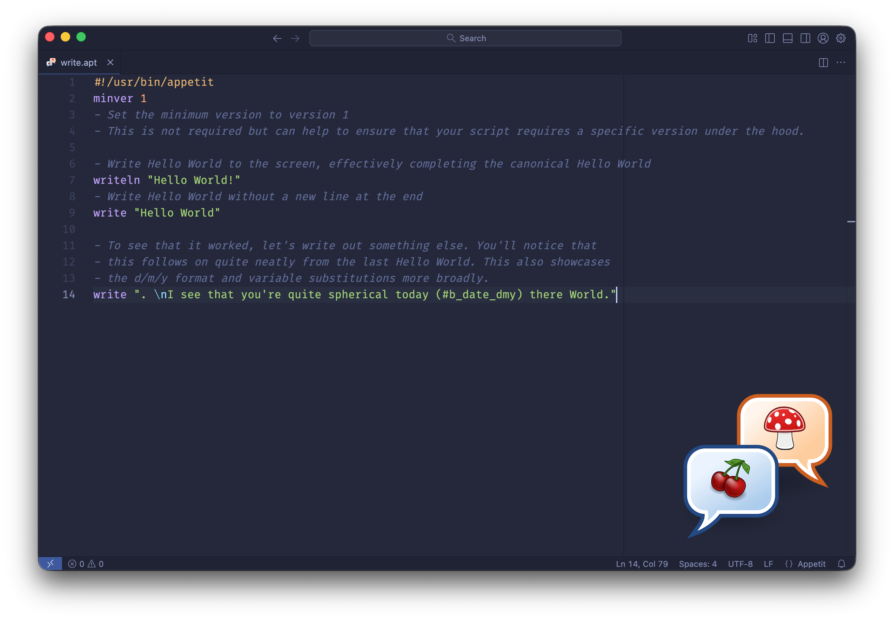

# Appetit

A simple "Hello World" with some variable substitution present.

### Table of Contents
- [Principles and About](#principles-and-about)
- [Building](#building)
    - [Visual Studio Code Extension](#visual-studio-code-extension)
    - [Appetit Scheduler (aptsched)](#appetit-scheduler-aptsched)
- [Using](#using)
- [Language Syntax and Functionality](#language-syntax-and-functionality)
- [Getting Involved](#getting-involved)
- [Licences](#licences)

## Principles and About
Appetit is a solution to an already solved problem: scripting simple actions on a computer. However, this project has some key principles that differentiate it from some other projects.

The project was started on 11/05/2025 and the first source release on GitHub (and to the world) was on 24/09/2025.

**Language Design**
- Everything in the language is a single line statement. Much like a recipe is a set of sequential instructions (hence the name of the language), an Appetit script is guided by single line instructions.
- Each statement is an approximation of English statement. This will not always be perfect but the goal remains: to have statements that, read out loud, approximate an English sentence. The idea here is that someone new to the language can make sense of what is happening.
- The language is meant to work across platforms. While there is functionality built in to leverage platform specific tools, the language is consistently revised to abstract users away from platform specific tools. In this way, a script written on a Mac should run on a FreeBSD machine assuming that you don't tap into platform-specific tools.

**Project**
- This project is designed as a way for me to learn about Go and some connected non-Go specific ideas (eg. parsing and tokenising text). As a non-professional programmer, this is first and foremost a hobby project so having fun is the most important thing.
- As an educator professionally, I offer up this project as a basis for others to learn. This includes critiques and I am very happy for this project to serve as the basis for people to learn what to do and what not to do.
- Finally, I wanted something that would provide me with something that would work across machines without any concern about the underlying OS. I wanted to run some simple sysadmin scripts across the devices I use that abstracted away some of the platform specific syntax so that I could run something on my Mac and Raspberry Pi running Linux, for instance, knowing that the script would run just as well on both.

More information about the language can be found at the project's homepage [here](https://bryanabsmith.com/). 

Before we dive in to using the language and getting started, we need to answer a simple question: *should I use this?*
The short answer is probably not, at least for now. You should not expect this to be reliable and in any shape that even approximates stable at this point in time. In light of that, you are **strongly encouraged to run this in a virtual machine or on a machine where data loss is acceptable**. That said, the goal long term is to make this reliable enough for me to run this on my home server where I have data that matters to me.

## Building
If you're still here, great! Let's figure out how to get up and running by first building the source. Appetit is just a regular Go application so simply do a quick `go build` in the `src/` directory and you'll get a compiled binary that isn't optimised. If you want an optimised release build with a better name that "main," execute the following:

    go build -ldflags="-s -w -X 'main.BuildDate=$(date)'" -o dist/appetit

This command is effectively what is used to generate release builds.

### Makefiles
There is a conventional Makefile for non-Windows systems and a `Make.ps1` PowerShell script that can be used on Windows to replace `make` (I'm aware here that the odds that you have `make` installed on a Windows machine are much lower than if you are using a non-Windows platform). There is one key difference to keep in mind: the `Makefile` will build binaries for all supported platforms whereas the `Make.ps1` file will only build Windows binaries.

The `Makefile` can do a few things:

| Target | Comment |
|----|----|
| [no parameter] | Run the freebsd, linux, macos, netbsd, openbsd, and windows |
| clean | Clean up any old builds by removing the `dist/` directory |
| freebsd | Make builds for FreeBSD (x86_64, armv6, arm64) |
| install | Run `me` and copy the resulting binary in `/usr/local/bin` |
| linux | Make builds for Linux (x86_64, armv6, arm64) |
| macos | Make builds for macOS (x86_64, arm64) |
| me | Make a build for your current platform and architecture |
| netbsd | Make builds for NetBSD (x86_64, armv6, arm64) |
| openbsd | Make builds for OpenBSD (x86_64, armv6, arm64) |
| pkg_deb | Build a Debian package for your current system |
| pkg_macos | Build a macOS installer package for your current system |
| release | Build release binaries and archives for all platforms including a source archive |
| source | Make a source archive |
| test | Run any tests |
| windows | Make builds for Windows (x86_64, arm64) |

If you don't know which one you want, you probably want to just run `make install` with elevated privileges on non-Windows systems.

### Installers
There are no official installers available. There are a few `make` options though that should do the job:
* You can install it via `sudo make install` on non-Windows systems to place the interpreter in /usr/local/bin/.
* On Debian based systems, you can run `make pkg_deb` to get a .deb file for your platform.
* On macOS systems, you can run `make pkg_macos` to generate a .pkg installer.

The Debian and macOS installers are the only ones supported now because (a) they're the only platforms I use and; (b) they are easy to generate.

### Visual Studio Code Extension
There is a simple Visual Studio Code extension available for the language. It's hosted in a seperate repository [here](https://github.com/appetitlang/vscode_extension). Instructions and details are available in that repo.

### Appetit Scheduler (aptsched)
A connected project---Appetit Scheduler (also called aptsched)---is available [here](https://github.com/appetitlang/aptsched) that allows you to schedule the execution of scripts in the same vein as something like cron, systemd timers, and launchd. Like the extension, more details can be found in the project's linked repo.

## Using
Using the app is as simple as invoking it with the name of the script:

    appetit [script name.apt]

There are a handful of flags that are documented via the `-help` flag. More details are below:

| Flag | Description |
|----|----|
| -allowexec | Allow execution of system commands. This defaults to disabled but is needed if you use the `execute` statement. |
| -create | Pass a file name to create a template script. Eg: `-create=~/Desktop/test.apt` |
| -dev | Prints out information relevant for development of the interpreter itself. |
| -docs | Serves up a local copy of some lightweight documentation. |
| -timer | Time the execution of the script. |
| -verbose | Output details about steps when certain actions are performed but don't normally have output. Defaults to disabled. |
| -version | Outputs the version number of the interpreter. |

## Language Syntax and Functionality
The documentation is available in one of two places:
1. [The project's homepage](https://bryanabsmith.com/appetit).
2. Running the interpreter with the `-docs` flag (see above). This will deploy a local web server that will host the documentation on port 8000.

**NOTE: THE LANGUAGE SYNTAX AND FUNCTIONALITY IS IN FLUX UNTIL DELCARED OTHERWISE.**

## Getting Involved
The project is very much my own right now as a learning experience and as something that I'm designing for myself. I'm happy to accept any feedback but note that I may very well not adopt it. In addition to this project being a learning experience, I always want it to be fun so any suggestions for improvements or fixes will be done when and where I am happy to do so. Please don't take this as a resistance to ideas as I'm happy to take them on board. Rather, consider this a caution that if the suggestion detracts from the learning, fun, or personal value I get from this project, I'm unlikely to take it on board.

## Licences

### The art/ folder
The icon bases were originally from the Tango Project which kindly released their icons into the public domain. Any versions of the code that you find with the Tango icons as the foundation are released into the public domain.

The current icons are original creations. They are licensed under the Creative Commons Attribution-NonCommercial-ShareAlike 4.0 International licence. See the details of this here: https://creativecommons.org/licenses/by-nc-sa/4.0/. In short, you are free to share and adapt the icon as long as you provide proper attribution, do not use the icon for commercial purposes, and licence any adaptations under the same CC licence.

### The docs/ folder
Licensed under the Creative Commons Attribution-NonCommercial-ShareAlike 4.0 International licence. See the details of this here: https://creativecommons.org/licenses/by-nc-sa/4.0/. In short, you are free to share and adapt the icon as long as you provide proper attribution, do not use the icon for commercial purposes, and licence any adaptations under the same CC licence.

### The packaging/ and src/ folder
Copyright 2025-2026 Bryan Smith.

Permission is hereby granted, free of charge, to any person obtaining a copy of this software and associated documentation files (the “Software"), to deal in the Software without restriction, including without limitation the rights to use, copy, modify, merge, publish, distribute, sublicense, and/or sell copies of the Software, and to permit persons to whom the Software is furnished to do so, subject to the following conditions:

The above copyright notice and this permission notice shall be included in all copies or substantial portions of the Software.

THE SOFTWARE IS PROVIDED “AS IS", WITHOUT WARRANTY OF ANY KIND, EXPRESS OR IMPLIED, INCLUDING BUT NOT LIMITED TO THE WARRANTIES OF MERCHANTABILITY, FITNESS FOR A PARTICULAR PURPOSE AND NONINFRINGEMENT. IN NO EVENT SHALL THE AUTHORS OR COPYRIGHT HOLDERS BE LIABLE FOR ANY CLAIM, DAMAGES OR OTHER LIABILITY, WHETHER IN AN ACTION OF CONTRACT, TORT OR OTHERWISE, ARISING FROM, OUT OF OR IN CONNECTION WITH THE SOFTWARE OR THE USE OR OTHER DEALINGS IN THE SOFTWARE.

### The samples/ folder
Licensed under the CC0 1.0 Universal. See the details here: https://creativecommons.org/publicdomain/zero/1.0/. In short, this is waiving any copyright and putting the sample code in the public domain.